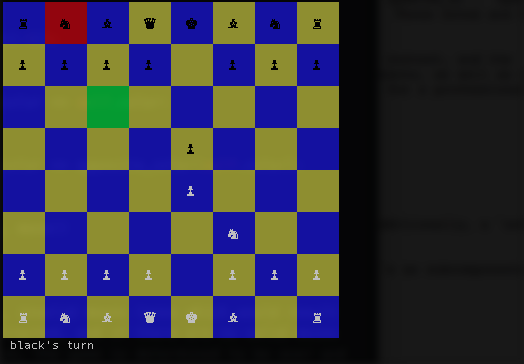

# ShallowBlue

ShallowBlue is a fully functional chess game written in Python. It is playable in any text-based terminal, with display rendering handled by the Python curses module.

## Features and Implementation

### Game Data

Game data is held on a `Board` object which represents the 64 chessboard positions as a two-dimensional list containing `Piece` objects. Every piece has either a specific set of available positions to move to relative to its own position (as in the case of the `King`, `Knight` and `Pawn`) or a set of directions in which it can move until it reaches an obstruction (as is the case with the `Queen`, `Rook` and `Bishop` pieces). The category (stepping or sliding) and the list of possible stepping moves or directions are included as information on the individual piece classes and calculated accordingly from the piece's position on a given board.

```python
def slide_moves(self, dirs):
    result = []
    for move in dirs:
        result.append(add(self.pos, move))
        while True:
            if not self.board.in_range(result[-1]):
                result.pop()
                break
            elif self.board.get(result[-1]).color == self.color:
                result.pop()
                break
            elif self.board.get(result[-1]).color == opposite_color(self.color):
                break
            else:
                result.append(add(result[-1], move))
    return result
```

After the list of possible moves is calculated, invalid moves (ones which would result in the current player's king in check) are subtracted, and if there are no valid moves available for any of the current player's pieces, the game is determined to be over and the program terminates.

The game also supports the more obscure chess moves such as castling, pawn capture en passant and pawn promotion. The first two of these both have restrictions which require keeping track of a piece's movement history. Kings can only castle if neither they nor the rook they are castling with have been previously moved, and an en passant can only take place on the turn immediately following a pawns two-step move. This is taken care of by supplying kings and rooks with a `has_moved` attribute and pawns with a `vulnerable` attribute, both of which are updated on a turn-by-turn basis whenever appropriate.

### Display

The terminal screen is divided into sixty-five curses windows, sixty-four for the squares of the board and one below the board to display messages. There are eight color pairs, four possible background colors and two foreground colors. Pieces are black and white, squares are alternating dark brown and light brown on terminals for which the curses `can_change_color()` method returns `True`, blue and yellow otherwise.



The `Display` object stores references to its windows in a two-dimensional list corresponding to the board list held by the `Board` object for easy coordination. As per usual curses practice, windows are only refreshed when their state has been changed (e.g. new color pair, new piece to be displayed at that location, etc.)

```python
def render(self):
    self.spaces = [[],[],[],[],[],[],[],[]]
    for i in range(8):
        for j in range(8):
            win = curses.newwin(3, 6, i*3, j*6)
            win.addstr(1, 2, self.board.get([i,j]).symbol)
            self.spaces[i].append(win)
            if [i, j] == self.selection:
                self.set_color([i, j], 3)
            elif (i+j)%2 == 0:
                self.set_color([i, j], 1)
            else:
                self.set_color([i, j], 4)
            win.refresh()
```

Initiating a display object disables key echoing and initiates cbreak mode, but both changes are reversed when the game is over, the curses main window closes and the program terminates.

## Demo

To access the game, simply download this repo and run the `game.py` file in a Python3 interpreter.
